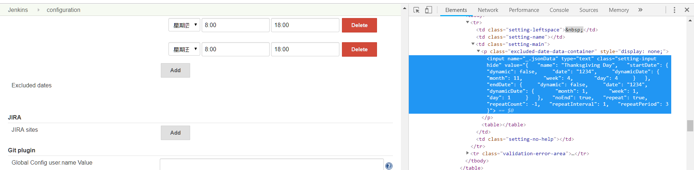
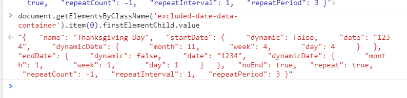

# Demo Working Hours Plugin Implemented with React

This is a demo to illustrate how to transfer data between the legacy jenkins backend to a new frontend.

Instead of using jelly tags, this demo use a tricky solution using html element's value property. 

The steps are:
1. Use **Jelly** to render our data to value of html elements (temporarily called “data container”)but add “display:none”
    The outcome would be like:
    
2. Then the new UI parse these elements and get the data.

    To acquire data in data container.
      ```javascript
      document.getElementsByClassName('excluded-date-data-container').item(0).firstElementChild.value
      ```
    The data would be like:
    
3. Once the data got edited, set a coordinate value to the “data container” like we are modifying the legacy form.

4. Since we only change the visibility of the element,the global save function still could gather information from it, then transfer it to backend.

5. In the backend, our model could deserialize the data and do something else. In fact, it is the constructor that gets called, but doesn't matter.

```java
    @DataBoundConstructor
    public ExcludedDate(String jsonData) {
        gson = new GsonBuilder().create();
        this.dataContainer = gson.fromJson(jsonData, DataContainer.class);
        this.jsonData = jsonData;
    }
```

6. **This time we put the form validation process in the frontend. But I believe there still need some validation in backend to guarantee the data correction.**

