<style>
    .img {
        margin:30px 0;
        box-shadow:1px 1px 1px 1px #cccc
    }

    .img-big{
        width:70%;
        margin-left:15%;
    }

    .img-small{
        width:40%;
        margin-left:30%;
    }
</style>

# Working Hours Jenkins Plugin

[](https://gitter.im/jenkinsci/working-hours-plugin?utm_source=badge&utm_medium=badge&utm_campaign=pr-badge&utm_content=badge)


The working hours plugin allows you to set up a schedule of allowable build times;
projects can opt in to use the schedule to prevent them from running outside of
configured allowable build times. If a build is scheduled during non-working hours
then it is kept in the build queue until the next allowable time.

Jobs opt in via the `enforceBuildSchedule` job parameter, which is provided by this
plugin. It can optionally take in a `branches` parameter to limit it's usage to only those branches.
This only works in MultiBranchPipelines.

## Usage

Sample job (scripted pipeline):
```
node {
  properties([enforceBuildSchedule()])
  stage('Do some stuff') {
    echo 'this can wait til morning'
  }
}
```

Sample job (declarative pipeline):
```
pipeline {
  agent any
  options {
    enforceBuildSchedule()
  }

  stages {
    stage('Do some stuff') {
      steps {
        echo 'this can wait til morning'
      }
    }
  }
}
```

Sample job with branches parameter (works in both declarative and scripted):
```
node {
  properties([enforceBuildSchedule(branches: ['dev', 'qa', 'prod')])
  stage('Do some stuff') {
    echo 'this can wait til morning'
  }
}
```

When the job runs outside of configured hours, you'll be able to see a tooltip from the job in the queue:


You can also see why the job is blocked in the build log:


## Releasing a blocked job

If you want a job to run anyway, you can use the `Release job` action which is
available from various places, such as the build action dropdown:


and the build page:


## Configuration

In order to use the working hours plugin, you must set up a schedule in the plugin's configuration page, you can access by 2 methods:
- Access by url, typically the url is `/working-hours/`, sometimes your url may have a prefix, then the url may be like `/jenkins/working-hours/`

- Access inside the system management page ( url: `/manage` ), which can be accessed by the button on the sidebar

 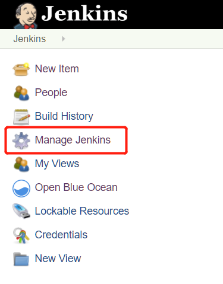

 Then Working Hours Plugin's entry is down below at

 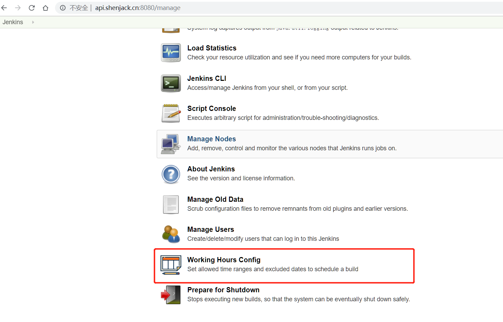

 You can configure both daily working hours and specific dates (such
  as holidays). The following configuration will cause jobs with  `enforceBuildSchedule` to queue if ran outside of Monday/Tuesday/Friday's 8:00 AM to 6:00 PM.

 

### Configure timezone
You can set the base timezone of your time ranges and excluded dates, they share the same config, which can be found on the right top, and would automatically save when changed.

 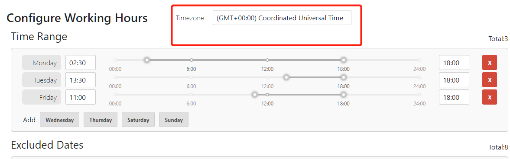

### Time ranges
This section contains the times when guarded steps are allowed for each day. You can click the seven buttons to add the day you want to allow, once it's added, you can set time range for it using the slide bar, for precision under 5 minutes, you can manually input the time like `12:06`.

 **Note** All time ranges are based on the timezone setting.

 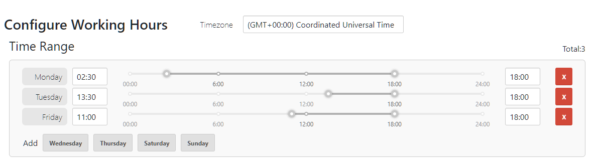


If the `enforceBuildStep` runs at a time that is not between a configured time range
for the day it's running, the job will be aborted. Please note that if no allowable
time ranges are configured for a day, `enforceBuildStep` will abort the job.

### Excluded dates
This section contains days to abort the `enforceBuildStep`. This takes precedence over a`Allowable build times`, so jobs
will always be queued on an excluded date.
 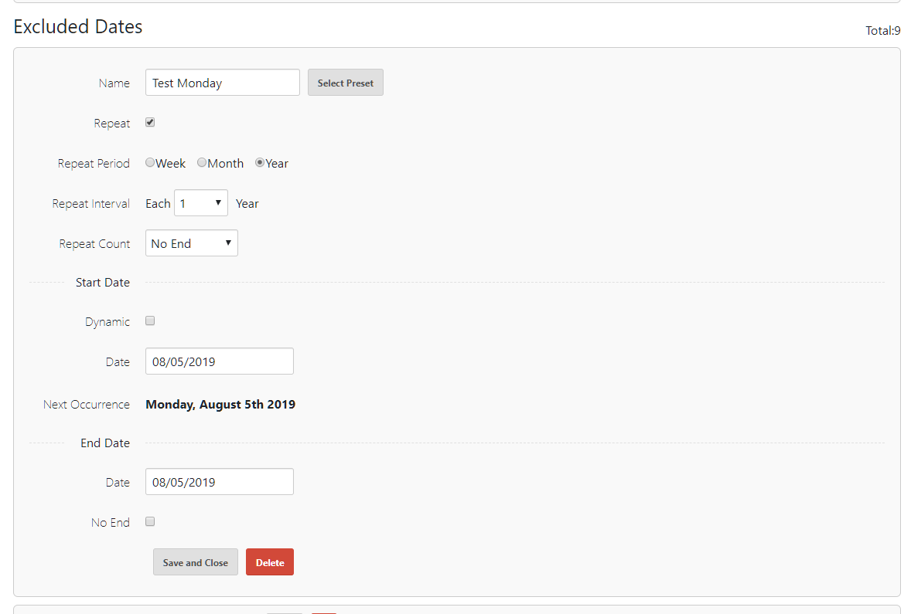


The `Start Date` indicates the rule that you want to define a date, you can set three types for a `Start Date`
- Static

Default, a `Start Date` is a static date, you can click on the date and choose the target date with the datepicker.
 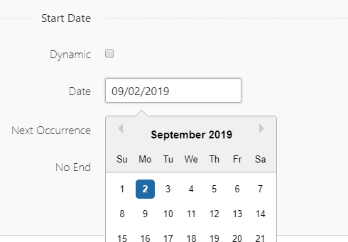

- Dynamic

If the dynamic option is checked, you can select a date on a dynamic base like `the second Sunday of July`.
 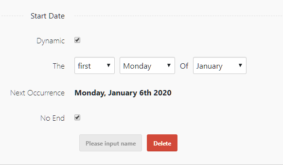

- Holiday

You can open a dialog to choose holiday presets by clicking the button
 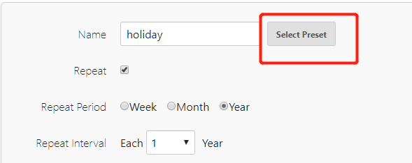
 Then in the dialog, you can first select a region, and then select a regional holiday, finally click apply to apply this holiday.
 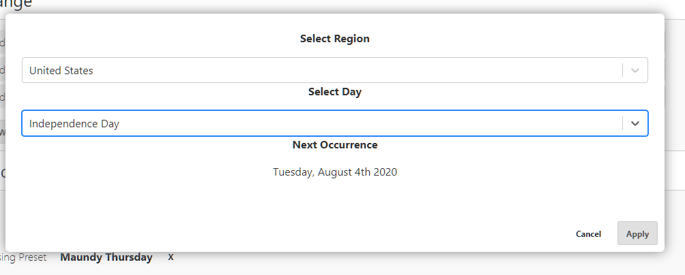

### There are also repeat configs to help you setting up a repeating rule
- Repeat period

You can set this to week/month/year, then your date would repeat weekly/monthly/yearly
- Repeat interval

Means how many periods are there between two occurrence. Default is 1, means your date will repeat each week/month/year.
- Repeat count

Means how many times your date would repeat, doesn't include the occurrences skipped by the `repeat interval`.


 **Note** These three repeat configs are only available for `Static/Dynamic` dates, `holidays` would default repeat each year and with no max repeat count.


- End Date

The `End Date` is a static date, `any` dates would stop repeat after this date, you can set an end date by not checking the `No End` checkbox.

**Note** The repeat would also stop if it meets the repeat count.

 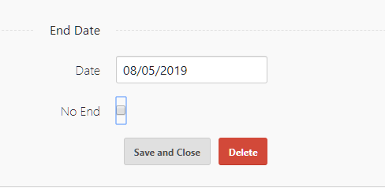

- Repeat

As repeat is default enabled, you can still disable a repeat by not checking the repeat checkbox


 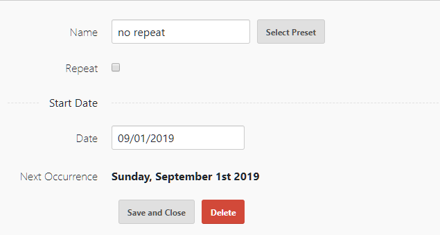
