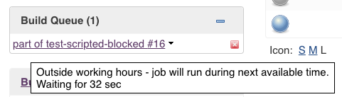
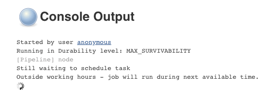
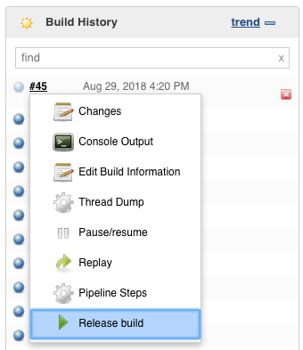
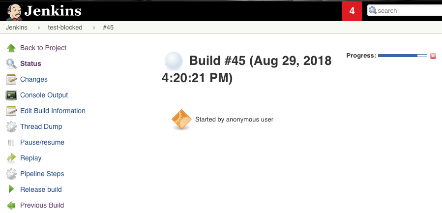
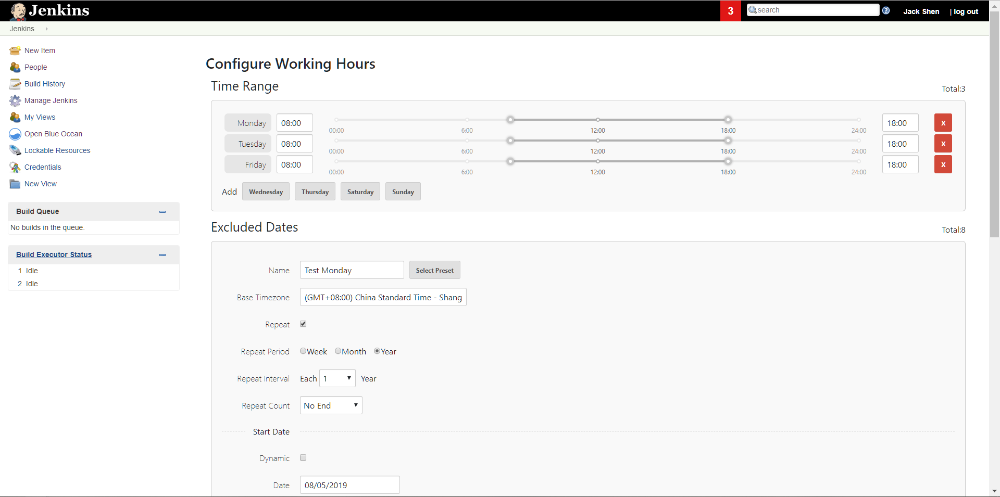
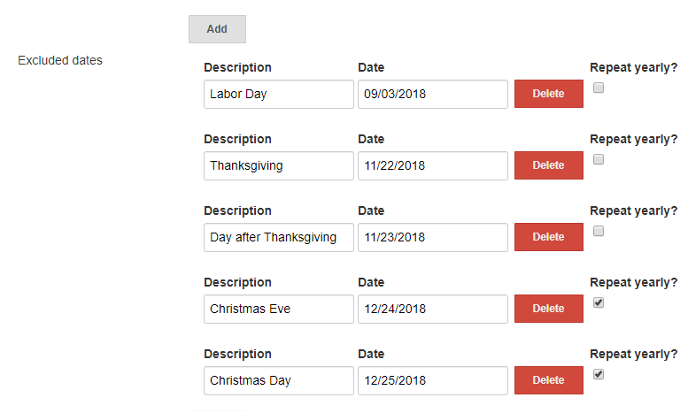

# Working Hours Jenkins Plugin

The working hours plugin allows you to set up a schedule of allowable build times;
projects can opt in to use the schedule to prevent them from running outside of
configured allowable build times. If a build is scheduled during non-working hours
then it is kept in the build queue until the next allowable time.

Jobs opt in via the `enforceBuildSchedule` job parameter, which is provided by this
plugin.

## Usage

Sample job (scripted pipeline):
```
node {
  properties([enforceBuildSchedule()])
  stage('Do some stuff') {
    echo 'this can wait til morning'
  }
}
```

Sample job (declarative pipeline):
```
pipeline {
  agent any
  options {
    enforceBuildSchedule()
  }

  stages {
    stage('Do some stuff') {
      steps {
        echo 'this can wait til morning'
      }
    }
  }
}
```

When the job runs outside of configured hours, you'll be able to see a tooltip from the job in the queue:



You can also see why the job is blocked in the build log:



## Releasing a blocked job

If you want a job to run anyway, you can use the `Release job` action which is
available from various places, such as the build action dropdown:



and the build page:




## Configuration

In order to use the working hours plugin, you must set up a schedule in your Jenkins
system configuration page. You can configure both daily working hours and specific dates (such
  as holidays). The following configuration will cause jobs with  `enforceBuildSchedule` to queue if ran outside of Monday - Friday 8:00 AM to 6:00 PM.

  *Note:* all times are local to your Jenkins master.



### Allowable build times
This section contains the times when guarded steps are allowed for each day. Times can be entered in one of the following formats:
- 24 hour eg `09:00`, `18:00`
- Abbreviated 24 hour eg `0900`, `1800`
- 12 hour eg `9:00 AM`, `6:00 PM`

**Note** All times are local to your Jenkins master.

If the `enforceBuildStep` runs at a time that is not between a configured time range
for the day it's running, the job will be aborted. Please note that if no allowable
time ranges are configured for a day, `enforceBuildStep` will abort the job.

### Excluded dates
This section contains explicit days (such as holidays) to abort the `enforceBuildStep`. This takes precedence over a`Allowable build times`, so jobs
will always be queued on an excluded date. Here's an example of some holidays configured in the Working Days calendar:


